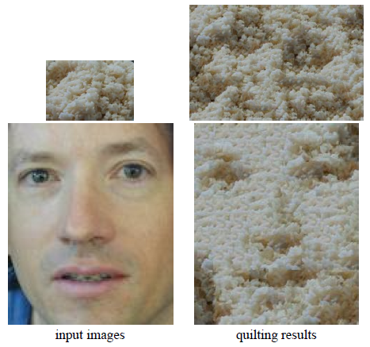
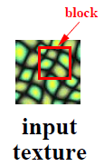
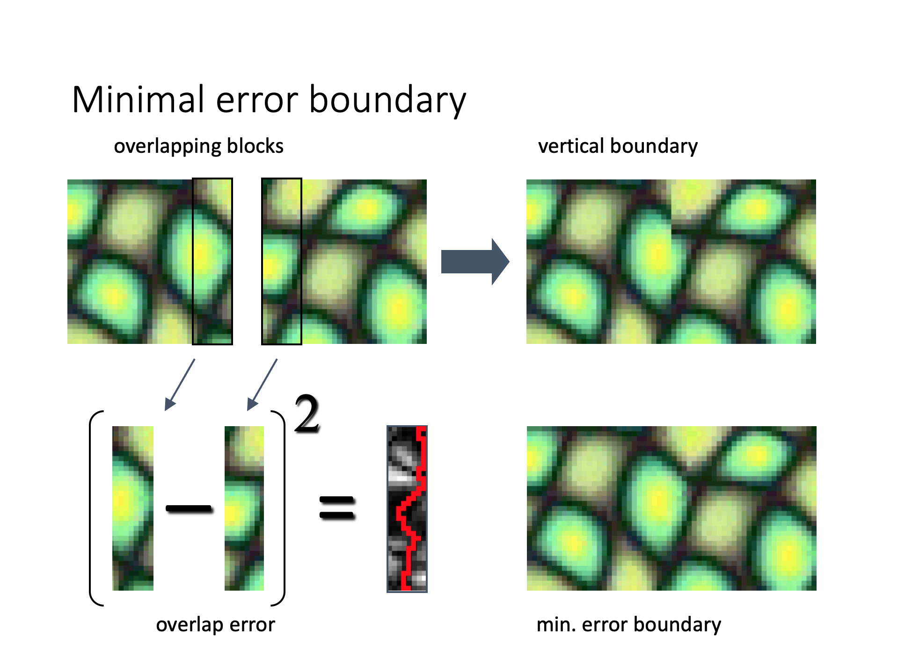
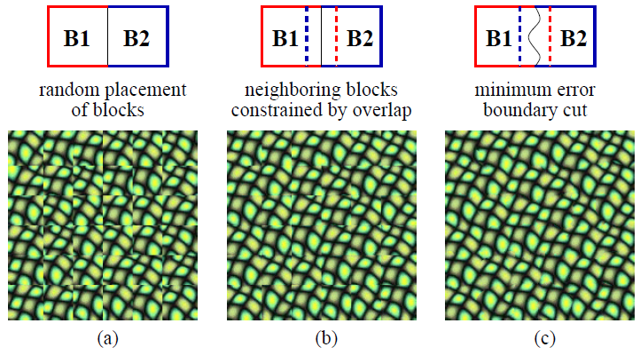
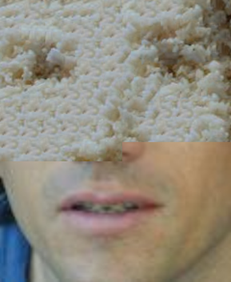

# Image Quilting for Texture Synthesis and Transfer

https://www.youtube.com/watch?v=QMiCNJofJUk

Image quilting is a technique of generating new images 
by stitching together patches of existing images.
It has applications of 

1) Texture synthesis, generating arbitrarily large textures from small real-world samples and 

2) Texture transfer, re-rendering an image in the style of another.

>The method
works directly on the images and does not require 3D information.

For more information, consult the original paper at https://people.eecs.berkeley.edu/~efros/research/quilting.html

All images in this readme come from the original paper or presentation at SIGGRAPH '01.

In this repository, we will be implementing the paper using Python and NumPy.

## Texture Synthesis

The algorithm starts with an input image and a block size:

We then define a minimum cost path between the overlap of two blocks:

We then build up a synthesized image by tiling small blocks of the input image.

(a) Here, we just randomly choose blocks

(b) Here we pick blocks that have the least overlap error

(c) We do everything in (c) but also cut along the minimum error boundary.

## Texture Transfer

>[Here] just add another constraint when sampling: similarity to underlying image at that spot

